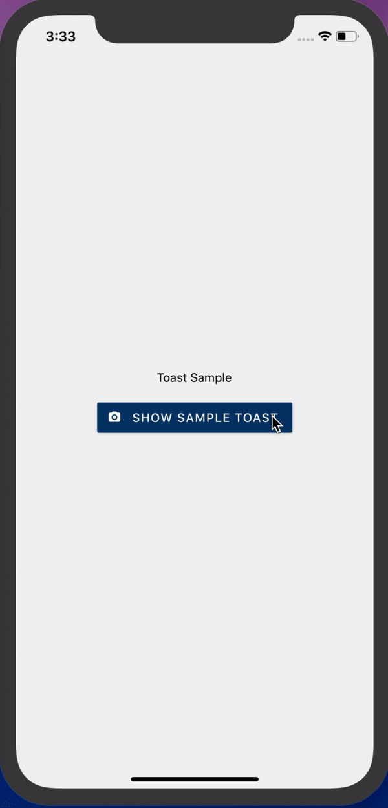

# react-native-toast-animated
### example basic Usage

    
    import React, {useRef} from 'react';
	import Toast from 'react-native-toast-animated';

	export default function basicUsage(){
	const toastRef = useRef();
	return(){

		<View>
		...
			<TouchableOpacity onPress={()=>{
				toastRef.current.showToast(
					{
						time: 5000,
						msg: 'This is a success Toast!!',
					},
					()=>{ console.log("toast ended") }
				)
			}}>
				<Text>ShowToast</Text>
			</TouchableOpacity>

			<Toast
				ref={toastRef}
				height={100} //optional
			/>
			...
		</View>
		}
	}

showToast parameters

| Parameter       | Type   | Required | Description                                         | Default |
|-----------------|--------|----------|-----------------------------------------------------|---------|
| msg             | string | true     | The message to be displayed in toast.               | -       |
| time            | number | false    | Close delay, after the time toast should be closed. | 2000    |
| backgroundColor | string | false    | Color code of the background color.                 | -       |
| type            | enum   | false    | danger or warn or success or info                   | success |
| friction        | number | false    | Friction of the animation of toast.                 | 1.2     |
| tesnsion        | number | false    | Tension for the animation of toast.                 | 0.8     |
| textColor       | string | false    | Color code of the text color.                       | #fff    |

